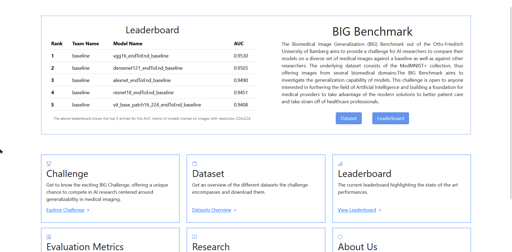
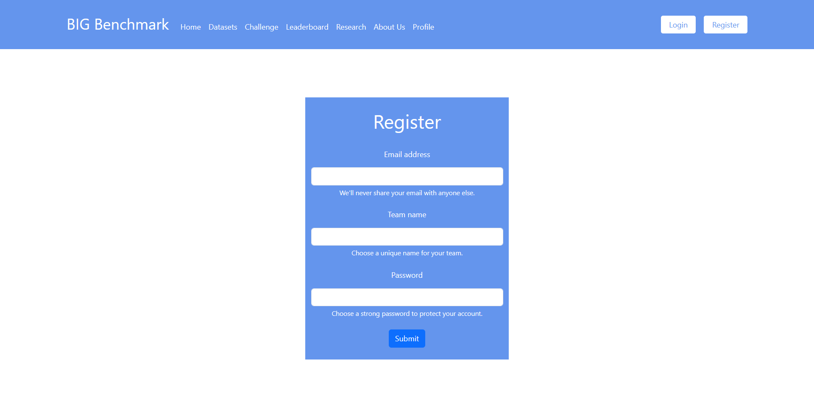
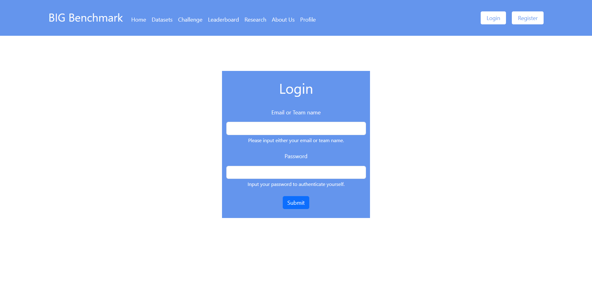
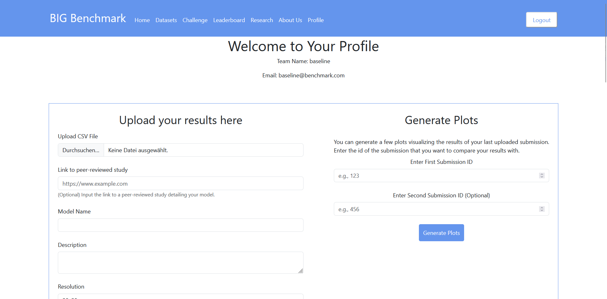
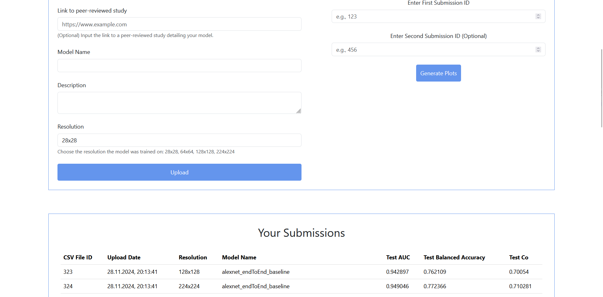
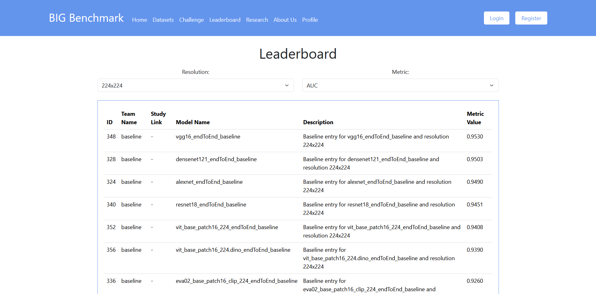

# Bachelor-Thesis

## model-training
The interplay of the code files in model-training looks as follows: most of these files rely on each other, however there is one important distinction - the training and the testing are separate. So during training, which will yield the training metrics and the validation metrics of the latest, best and final model, no evaluation on the test set takes place. The files working together to guarantee a smooth training procedure are:
- mm-pt_config.yaml
- main.py
- data.py
- multi_head_multi_domain_pt.py
- backbones.py
- model.py
- utils.py

For the training, multi_head_multi_domain_pt.py contains by far the most logic. This includes the sampling procedure of the multi-domain multi-task training paradigm of Woerner et al. (2024)

The testing then yields the test metrics as well as a .csv-file with the predictions for the test samples. The files working together to guarantee a smooth testing procedure are:
- mm-pt_config.yaml
- test.py
- data.py
- backbones.py
- multi_head_multi_domain_pt.py
- model.py
- utils.py

## reevaluation
This part of the code is focused on the reevaluation of the models presented by Doerrich et al. (2024). The existing models were reevaluated to obtain the metrics used in the bespoke benchmark presented in this thesis. Some parameters like kNN_true in evaluate.py were manipulated by hand and thus shouldn't be viewed as static with a fixed value.

Brief summary of the functionality of the files:

evaluate.py calculates the test metrics for a model trained on an individual dataset

reevaluate.py takes .csv-files of the individual models and stores their performance for all resolutions separately in a .csv-file dedicated to the dataset the model was trained on

reevaluation-aggregate.py calculates the average metric for a model based on the model's performance on all the datasets for each resolution separately

Both the separation of training and testing as well as the hardcoded use of parameters are not necessary for the code to run and thus could be improved by rewriting it. This could entail including testing immediately after training, such that in order to fully train and test a model, only one command, namely running main.py, would need to be executed. Hardcoded variables could be handled more elegantly by offering the possibility to specify them in e.g. a .yaml file or iterating over all the possible values and doing the reevaluation for all possible combinations sequentially.

Note: paths and access tokens were replaced with placeholders where possible and remembered.

Cited sources:

Woerner, S., Jaques, A., & Baumgartner, C.F. (2024). A comprehensive and easy-to-use multi-domain multi-task medical imaging meta-dataset (MedIMeta). ArXiv, abs/2404.16000.

Doerrich, S., Di Salvo, F., Brockmann, J., & Ledig, C. (2024). Rethinking Model Prototyping through the MedMNIST+ Dataset Collection. ArXiv, abs/2404.15786.

## Web-Development
The website was built with three key technologies: React, Flask and MySQL.

For building the website, the Javascript-based React was used for the User Interface. Files with suffix .jsx indicate React files, with App.jsx in the Web-Development/src folder being the main file controlling the front end of the website. An illustration of how this front end looks like is given below. The landing/home page of the website is displayed.

The focus of the web development efforts wasn't design but to implement a few core functionalities. Such a landing page which shows an excerpt of the leaderboard for the challenge around the benchmark, a brief description of the benchmark and that offers a few elements for navigation to the most important pages is one such core functionality.

The back end of the website was implemented with the python-based Flask. The code for the back end is situated in Web-Development/flask-server folder. There, the app.py is the key program that controls the back end, creating a server to interact with the front end. The back end handles the server-side logic, connects the front end to the database and provides apis to for example fetch data. An example for this is already on the landing page, where the leaderboard excerpt is fetched from the MySQL database that stores the data via an API request.

Taking this landing page as the starting point, the website can be further explored. Visiting other pages, a login and register button can be seen.
Following those buttons, one gets redirected to the register and login page, respectively. The possibility to create and account and log in is the second core functionality.

In order to register, data for authentication of users has to be lodged in the database. MySQL is a popular choice for databases, built on the Structured Query Language. The structure of the database is specified in Web-Development/flask-server/app/models.py

Logging in is realized via client-side sessions.

Upon being logged in, two more core functionalities can be accessed.

Firstly, a submission to the challenge can be made. This includes specifying some metadata for the .csv-file which resembles the heart of the submission. This .csv-file contains the predicted probabilities, the prediction of the class/label(s) which follow from that and the specification for which dataset this prediction is made. Based on this .csv-file which is uploaded to the server but never saved in its original format, the test metrics for a submission are calculated in the back end. The results of this calculation are then stored in the database. Secondly, plots based on previous submissions can be generated. These plots so far encompass a dataset-wise overview of a model's performance, split by metric, so three plots, one for each metric. In total six such plots are generated, three for the line-chart depicting a model's performance on the given metric and three for depicting the box plot for the performance on the given metric across the datasets. These csv file ids can be taken from the following overview over a user's submissions, which can be viewed below the mentioned two core functionalities.

Another place to see important csv file ids is the Leaderboard page, which resembles the last core functionality that is touched on here.

The leaderboard page shows an overview over the 10 best submissions, filtered by an evaluation metric and the resolution of the images the training was conducted on. The data is queried from the database and handed over from the back end to the front end to display. Such a leaderboard is an essential part of any challenge for a benchmark.
